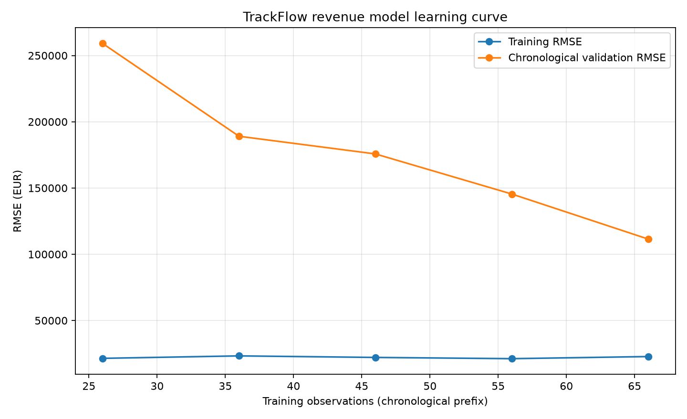

# TrackFlow Regression Model Evaluation

- **Model:** `RandomForestRegressor` (the existing TrackFlow Random Forest regressor).
- **Dataset:** `/workspaces/ft-ai-2-milestone-v2-lamiabouzari/data/raw/trackflow_sales.csv`; consolidated monthly `revenue_eur`.
- **Dataset period:** 2016-01-01 through 2025-12-01.
- **Development/train period:** 2017-01-01 through 2023-12-01.
- **Held-out validation period:** 2024-01-01 through 2025-12-01.

## Cross-validation strategy

Expanding-window `TimeSeriesSplit` on the 2016-01–2023-12 development period; 5 folds; no shuffle. Each validation block follows its training prefix strictly. The established causal lag/rolling and known-calendar features are reused. Validation rows use only prior-month observations, as in one-step-ahead evaluation.

| Fold | Training period | Validation period | MAE (EUR) | RMSE (EUR) |
|---:|---|---|---:|---:|
| 1 | 2017-01-01–2018-02-01 | 2018-03-01–2019-04-01 | 52,212.65 | 70,696.26 |
| 2 | 2017-01-01–2019-04-01 | 2019-05-01–2020-06-01 | 58,875.07 | 79,041.30 |
| 3 | 2017-01-01–2020-06-01 | 2020-07-01–2021-08-01 | 59,155.93 | 75,723.43 |
| 4 | 2017-01-01–2021-08-01 | 2021-09-01–2022-10-01 | 72,801.36 | 87,383.98 |
| 5 | 2017-01-01–2022-10-01 | 2022-11-01–2023-12-01 | 118,090.19 | 131,267.30 |

| Cross-validation summary | MAE (EUR) | RMSE (EUR) |
|---|---:|---:|
| Mean ± sample standard deviation | 72,227.04 ± 26,708.91 | 88,822.45 ± 24,492.08 |

## Training and held-out validation

- **Training:** MAE **€18,832.11**, RMSE **€23,549.91**.
- **Validation:** MAE **€97,732.42**, RMSE **€125,905.40**.

RMSE is particularly useful for TrackFlow because squaring residuals penalizes large misses more heavily. Missing the strong November/December revenue peaks has a larger business impact than a similarly sized collection of small monthly errors. MAE is also reported because its EUR scale is directly interpretable as the average absolute monthly miss.

## Learning curve

Training prefixes grow chronologically and are scored against the same later 18-month development window. The curve compares in-sample training RMSE with validation RMSE in EUR; it does not shuffle observations.

| Training rows | Last training month | Training RMSE (EUR) | Validation RMSE (EUR) |
|---:|---|---:|---:|
| 26 | 2019-02-01 | 21,455.50 | 259,119.81 |
| 36 | 2019-12-01 | 23,299.97 | 189,066.08 |
| 46 | 2020-10-01 | 22,135.41 | 175,725.98 |
| 56 | 2021-08-01 | 21,204.84 | 145,457.21 |
| 66 | 2022-06-01 | 22,801.27 | 111,449.97 |

Validation RMSE improves as the chronological training set grows, suggesting additional historical data is helping generalization.

## Diagnosis

**Overfitting.** This is based on the observed training RMSE, held-out validation RMSE, cross-validation mean RMSE, and the learning curve above (not a predetermined label).

**Corrective action:** Use a shallower Random Forest or increase min_samples_leaf, then compare the same chronological folds.

## Leakage and ordering check

Chronological ordering was preserved throughout: no samples were shuffled; all CV training timestamps precede their validation timestamps; the final validation period begins after the training period. Existing features are causal (lags and rolling statistics are shifted to exclude the current target); calendar features are known in advance. Validation scoring is one-step-ahead, where only revenue observed before a month is used for its lag features.
