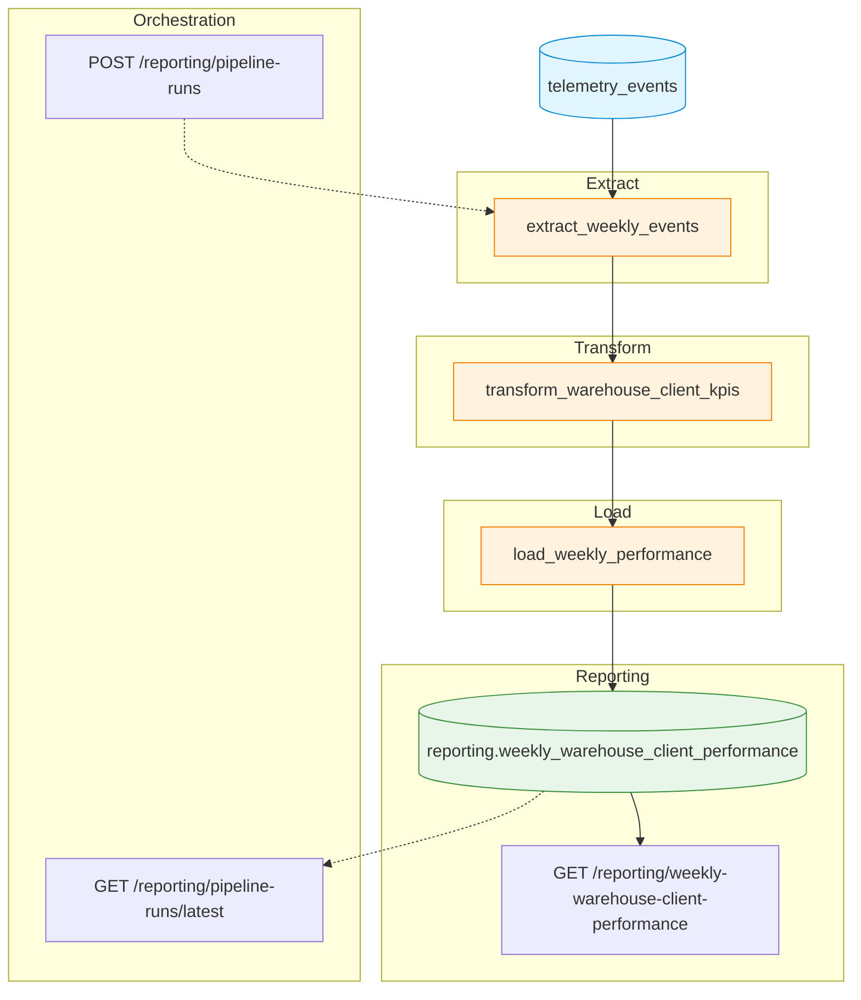

# Pipeline Design — Weekly Warehouse & Client Performance Report

> **TrackFlow — Business Performance Data Pipeline**
>
> Status: **Design** (implementation deferred to Part 2)
>
> Authors: TrackFlow Tech
>
> Date: 2026-09-17

---

## 1. Current State

### Telemetry Events Already Exist

TrackFlow already captures **16 telemetry event types** through the ingestion endpoint `POST /telemetry/events`. Every event follows the standard TrackFlow envelope:

| Envelope field    | Type              | Description                              |
|-------------------|-------------------|------------------------------------------|
| `eventId`         | UUID              | Unique event instance identifier         |
| `timestamp`       | datetime (ISO 8601 UTC) | Moment the event occurred          |
| `sessionId`       | UUID              | User session identifier                  |
| `userId`          | string            | Stable internal user identifier          |
| `event_type`      | string (snake_case) | Canonical event name                   |
| `schemaVersion`   | string (semver)   | Schema version for evolution             |
| `requestId`       | UUID \| null      | Correlation ID for backend request/trace |
| `properties`      | object (JSONB)    | Event-specific payload (allowlist)       |

Events are validated server-side by `TelemetryEvent` (Pydantic model) and persisted as `TelemetryEventRecord` rows in the **`telemetry_events`** PostgreSQL table.

### Where Telemetry Is Stored

All telemetry lives in the **`telemetry_events`** table (SQLModel, PostgreSQL), indexed on `timestamp`, `event_type`, and a GIN index on the `tags` JSONB column for efficient property lookups.

```sql
TABLE telemetry_events (
    event_id       UUID PRIMARY KEY,
    timestamp      TIMESTAMPTZ  NOT NULL,
    session_id     UUID         NOT NULL,
    user_id        TEXT         NOT NULL,
    event_type     TEXT         NOT NULL,
    schema_version TEXT         NOT NULL,
    request_id     UUID,
    tags           JSONB        NOT NULL  -- event-specific properties
);
```

The database session is managed by `get_inventory_db()` from `services/database.py`, which creates a SQLModel `Session` connected to the configured Postgres `DATABASE_URL`.

### What GET /telemetry/report Currently Answers

The existing `GET /telemetry/report` endpoint returns **three technical/operational metrics** computed by `services/telemetry/analysis.py`:

| Metric                        | Events used                                   | Audience |
|-------------------------------|-----------------------------------------------|----------|
| `api_failures_by_endpoint`    | `api_request_failed`                          | Engineers |
| `auth_security_signals`       | `user_login_failed`, `permission_denied`      | Security/Eng |
| `frontend_performance`        | `page_load_measured`, `search_query_executed` | Engineers/UX |

These metrics answer operational questions like *"Which API routes fail most often?"* and *"Which screens are slowest for internal users?"* They are cached in-memory for 60 seconds and designed for engineering diagnostics, not business reporting.

### What Business Question Remains Unanswered

TrackFlow's CEO (Thomas) and Head of Warehouse Operations (Ana) currently have **no weekly business report** that answers:

> *"How is each warehouse performing for each client — in terms of inbound volume, outbound throughput, stockout frequency, and inventory discrepancy rate?"*

There is no mechanism to aggregate `telemetry_events` into a per-(warehouse, client, week) business KPI row, and no destination table exists to serve this data to leadership.

---

## 2. Pipeline Purpose

**To deliver a consolidated weekly business report by aggregating TrackFlow telemetry events (`inbound_order_created`, `outbound_order_created`, `stock_threshold_triggered`, `inventory_discrepancy_detected`) into per-(warehouse, client, ISO week) KPIs — inbound volume, outbound throughput, stockout frequency, and discrepancy rate — so that Thomas (CEO) and Ana (Head of Warehouse Operations) can monitor operational health every Monday morning.**

---

## 3. Extraction

### Source

| Property    | Value              |
|-------------|--------------------|
| **Table**   | `telemetry_events` |
| **Engine**  | PostgreSQL (SQLModel) |
| **Schema**  | `public` (or configured inventory schema) |
| **Access**  | Read-only via `Session` connected to `get_inventory_db()` |

### Relevant Event Types

Only four event types are extracted:

1. `inbound_order_created`
2. `outbound_order_created`
3. `stock_threshold_triggered`
4. `inventory_discrepancy_detected`

### Actual Payload Fields (from `docs/telemetry/event-schemas.json`)

All four events share these common properties in the `tags` JSONB column, confirmed by inspecting the repository schemas:

| Property             | Type                                        | Present In                                            |
|----------------------|---------------------------------------------|-------------------------------------------------------|
| `warehouse`          | `enum("los_angeles", "zaragoza")`           | all four event types                                  |
| `client_id`          | `string`                                    | all four event types                                  |
| `product_id`         | `string`                                    | all four event types                                  |
| `product_category`   | `enum("fashion", "electronics", "cosmetics")`| all four event types                                  |
| `quantity`           | `integer`                                   | all four event types                                  |
| `order_id`           | `string`                                    | `inbound_order_created`, `outbound_order_created`     |
| `source_type`        | `enum("purchase_order", "return", "transfer")` | `inbound_order_created` (optional)                 |
| `destination_type`   | `enum("customer_shipment", "return_to_supplier", "transfer")` | `outbound_order_created` (optional) |
| `threshold_value`    | `integer`                                   | `stock_threshold_triggered`                           |
| `expected_quantity`  | `integer`                                   | `inventory_discrepancy_detected`                      |
| `actual_quantity`    | `integer`                                   | `inventory_discrepancy_detected`                      |

### Source / Update Cadence

| Property              | Value                                    |
|-----------------------|------------------------------------------|
| Extract window        | Previous Monday 00:00:00 UTC → window_end (exclusive) |
| Refresh cadence       | **Weekly**, Monday 02:00 UTC (before business hours) |
| Freshness SLA         | Data must reflect all events up to 23:59:59 UTC Sunday |

### Existing Domain Tables (read-only reference)

The following domain tables exist in the same Postgres database but are **not** used as pipeline sources (telemetry `tags` are the source of truth for this pipeline). They may be consulted for validation or cross-referencing:

| Table            | Contents                       | Key fields                              |
|------------------|--------------------------------|-----------------------------------------|
| `skus`           | SKU catalog per warehouse      | `sku`, `client_name`, `warehouse`       |
| `stock_entries`  | Inbound stock movements (ledger) | `sku_id`, `quantity`, `warehouse`     |
| `stock_exits`    | Outbound stock movements (ledger) | `sku_id`, `quantity`, `warehouse`    |

---

## 4. Data Flow



### Flow Description

1. **`extract_weekly_events`** — Queries `telemetry_events` for the four required event types within the target ISO week window. Extracts envelope fields (`timestamp`, `event_type`) and JSONB properties (`warehouse`, `client_id`, `quantity` and others from `tags`).
2. **`transform_warehouse_client_kpis`** — Groups events by `warehouse` + `client_id` + ISO week start (Monday UTC). Computes the four KPIs per group.
3. **`load_weekly_performance`** — UPSERTs the aggregated row into `reporting.weekly_warehouse_client_performance`.

---

## 5. Transformation / Aggregation

Each row is uniquely identified by the composite key `(warehouse, client_id, week_start)`. **Clients are never aggregated into the same row.**

### Grouping Key

| Dimension    | Source                                         | Rules                                                |
|-------------|------------------------------------------------|------------------------------------------------------|
| `warehouse`  | `tags -> 'warehouse'`                          | One of `los_angeles`, `zaragoza`                     |
| `client_id`  | `tags -> 'client_id'`                          | Opaque string identifier; each client gets its own row |
| `week_start` | ISO week of `timestamp`, Monday 00:00:00 UTC   | Computed via `date_trunc('week', timestamp)` in UTC  |

### KPI Computations

| KPI                          | SQL / Logic                                                                                | Data type |
|------------------------------|--------------------------------------------------------------------------------------------|-----------|
| `inbound_units_count`        | `SUM(CASE WHEN event_type = 'inbound_order_created' THEN (tags->>'quantity')::int ELSE 0 END)` | integer   |
| `outbound_orders_count`      | `COUNT(*) FILTER (WHERE event_type = 'outbound_order_created')`                              | integer   |
| `stockout_events_count`      | `COUNT(*) FILTER (WHERE event_type = 'stock_threshold_triggered')`                           | integer   |
| `discrepancy_events_count`   | `COUNT(*) FILTER (WHERE event_type = 'inventory_discrepancy_detected')`                      | integer   |
| `discrepancy_rate`           | `CASE WHEN outbound_orders_count > 0 THEN discrepancy_events_count::numeric / outbound_orders_count ELSE 0 END` | numeric |

#### Detailed Rules

1. **`inbound_units_count`**: Sum of the `quantity` property from every `inbound_order_created` event in the group. This represents total units received, not order count.
2. **`outbound_orders_count`**: Count of `outbound_order_created` events. Each event represents one outbound order; multiple SKUs on the same order produce separate events, so this is an order-line count.
3. **`stockout_events_count`**: Count of `stock_threshold_triggered` events. Each event fires when a SKU crosses its minimum threshold.
4. **`discrepancy_events_count`**: Count of `inventory_discrepancy_detected` events. Each event represents one detected mismatch between expected and actual stock.
5. **`discrepancy_rate`**: Computed as `discrepancy_events_count / outbound_orders_count`. Returns `0` when `outbound_orders_count` is 0 to avoid division by zero.

#### ISO Week Start (Monday UTC)

The `week_start` date is derived from `timestamp` using:

```sql
-- ISO 8601 week: Monday is day 1
date_trunc('week', timestamp)::date AS week_start
```

This is computed in **UTC** to ensure consistency across warehouses (Los Angeles and Zaragoza are in different time zones, but all timestamps are stored in UTC).

---

## 6. Update Strategy

Existing weekly rows are **updated in place** using an **UPSERT** (PostgreSQL `INSERT ... ON CONFLICT ... DO UPDATE`). When a row with the same `(warehouse, client_id, week_start)` already exists, the KPI columns and `computed_at` are refreshed instead of inserting a duplicate.

```sql
INSERT INTO reporting.weekly_warehouse_client_performance
    (warehouse, client_id, week_start, inbound_units_count, outbound_orders_count,
     stockout_events_count, discrepancy_events_count, discrepancy_rate, computed_at)
VALUES ($1, $2, $3, $4, $5, $6, $7, $8, now())
ON CONFLICT ON CONSTRAINT uq_weekly_warehouse_client
DO UPDATE SET
    inbound_units_count        = EXCLUDED.inbound_units_count,
    outbound_orders_count      = EXCLUDED.outbound_orders_count,
    stockout_events_count      = EXCLUDED.stockout_events_count,
    discrepancy_events_count   = EXCLUDED.discrepancy_events_count,
    discrepancy_rate           = EXCLUDED.discrepancy_rate,
    computed_at              = now();
```

The unique constraint:

```sql
CREATE UNIQUE INDEX uq_weekly_warehouse_client
    ON reporting.weekly_warehouse_client_performance (warehouse, client_id, week_start);
```

---

## 7. Idempotency and Resilience

The pipeline is designed to produce **the same result regardless of how many times it is run**, provided the source data has not changed.

### Duplicate Source Events

The `telemetry_events` table uses `event_id` (UUID) as its primary key, so **exact duplicates cannot exist at the storage level**. However, if events were re-ingested with different `event_id` values but identical semantics (same timestamp, same properties), the aggregation would count them. This is acceptable because:

- The pipeline sources events by a **UTC time window**, not by event_id.
- A legitimate re-ingestion of lost events is expected to produce the same business KPI as the original.
- The UPSERT ensures the final row reflects whatever data is in the window at run time.

### Deduplication Key Based on Telemetry Schema

Each `TelemetryEventRecord` has a unique `event_id` PK. The pipeline does **not** need to deduplicate within `telemetry_events` because the database enforces this. If the pipeline is re-run with overlapping windows, the **aggregation is idempotent by construction**: `SUM` on the same rows always produces the same result, and the UPSERT overwrites the previous KPI values.

### Partial Load Failure

If the pipeline fails partway through the **Load** phase (e.g., UPSERT succeeds for warehouse A but fails for warehouse B), the partially-inserted rows remain in the destination table. On re-run, the extract-and-transform recomputes all groups in the window, and the UPSERT overwrites any partial data. **The final state is always consistent after a successful re-run.**

### Rerun After Failure

A re-run after any type of failure:

1. Reads the same time window from `telemetry_events`
2. Regroups and reaggregates all source rows
3. UPSERTs every group

Because the source window is deterministic and the aggregation is deterministic, **a re-run produces the same result as a clean run**.

### UPSERT (Detailed)

The `ON CONFLICT ON CONSTRAINT uq_weekly_warehouse_client` clause ensures:

- **First run**: Inserts new rows for every `(warehouse, client_id, week_start)` combination.
- **Subsequent runs**: Updates existing rows in place. No duplicate rows are ever created.

### Late-Arriving Events

Events with timestamps that fall within a **past** ISO week (e.g., an `inbound_order_created` from last week that arrived late) will be picked up if:

1. The pipeline is re-run for that past week's window.
2. The re-run re-aggregates the full window including the late event.
3. The UPSERT updates the existing row with the new KPI values.

**Design choice**: The pipeline always processes a **full week window**, not incremental changes. This makes late-arriving events naturally captured on the next re-run for that week.

**Operational rule**: If significant late data is expected for a past week, re-run that week's pipeline manually or adjust the weekly scheduled window to cover the trailing window.

### Concurrent Scheduled / Manual Runs

Concurrent pipeline runs for the **same** week window would race on the same UPSERT rows. Mitigations:

- The extract query uses `timestamp < end_of_week` which is stable across processes.
- UPSERT with `ON CONFLICT DO UPDATE` is atomic per row in PostgreSQL.
- If two runs overlap, the second run's `computed_at` timestamp reflects the later completion.
- For production, a **pipeline-run lock** (via the execution log table — see §8) prevents concurrent runs: the flow checks for a `Running` entry before starting.

---

## 8. Execution Log

Pipeline runs are recorded in a **`reporting.pipeline_runs`** table to provide audit trail and observability.

### Table Structure

**Table name:** `reporting.pipeline_runs`

| Field             | Datatype                    | Auditing Purpose                                              |
|-------------------|-----------------------------|---------------------------------------------------------------|
| `run_id`          | `UUID` (PK)                 | Unique identifier for every pipeline execution                |
| `started_at`      | `TIMESTAMPTZ`               | When the pipeline run started; used for duration and ordering |
| `completed_at`    | `TIMESTAMPTZ` (nullable)    | When the pipeline run finished; `NULL` while running or failed |
| `records_processed` | `INTEGER` (default 0)     | Number of rows UPSERTed into the destination table            |
| `status`          | `TEXT`                      | One of `Running`, `Completed`, `Failed`                       |
| `error_details`   | `TEXT` (nullable)           | Error message and stack trace if `status = 'Failed'`          |
| `week_start`      | `DATE`                      | The ISO week processed by this run (Monday UTC)               |
| `week_end`        | `DATE`                      | The Sunday end of the processed week (Monday + 6 days)        |
| `triggered_by`    | `TEXT`                      | How the run was triggered: `scheduled`, `manual`, `api`       |

### Run Lifecycle

1. On start: `INSERT` with `status = 'Running'`, `started_at = now()`.
2. On success: `UPDATE` with `status = 'Completed'`, `completed_at = now()`, `records_processed = <count>`.
3. On failure: `UPDATE` with `status = 'Failed'`, `completed_at = now()`, `error_details = <details>`.

### SQL (DDL)

```sql
CREATE TABLE IF NOT EXISTS reporting.pipeline_runs (
    run_id            UUID PRIMARY KEY DEFAULT gen_random_uuid(),
    started_at        TIMESTAMPTZ NOT NULL DEFAULT now(),
    completed_at      TIMESTAMPTZ,
    records_processed INTEGER NOT NULL DEFAULT 0,
    status            TEXT NOT NULL DEFAULT 'Running'
                     CHECK (status IN ('Running', 'Completed', 'Failed'),
    error_details    TEXT,
    week_start        DATE NOT NULL,
    week_end          DATE NOT NULL,
    triggered_by      TEXT NOT NULL DEFAULT 'scheduled'
);

CREATE INDEX ix_pipeline_runs_status ON reporting.pipeline_runs (status);
CREATE INDEX ix_pipeline_runs_started ON reporting.pipeline_runs (started_at DESC);
```

---

## 9. Observability

### Distinguishing Legitimate Zero vs. Failures

Scenario                          | `reporting` row          | `pipeline_runs` status   | `telemetry_events` query   |
|----------------------------------|--------------------------|--------------------------|---------------------------|
| No activity for a client/week    | Row exists with all 0s   | `Completed`              | Zero rows for that group  |
| Telemetry capture failure       | Row may be missing or stale | Depends                  | No events in source         |
| Pipeline never ran              | No row for that week      | No entry or `Failed`      | Source contains events       |

#### How to distinguish

1. **Legitimate zero activity**: Pipeline ran successfully (`Completed`), destination row exists with 0s for all KPIs. Querying `pipeline_runs` for that `week_start` shows a successful run.
2. **Telemetry capture failure**: The pipeline ran successfully but found no events in the window — this would produce 0 rows in the source result set, leading to no destination rows. Distinguished by cross-referencing: query `telemetry_events` directly for the week.l If there are events but no destination rows, the pipeline may have used a wrong window. If there are no events at all, the telemetry collection itself may have failed.
3. **Pipeline never ran**: No entry in `pipeline_runs` for that `week_start` at all. The destination table has no row for that week.

### Traceability: Telemetry Event → Aggregation → Final Business Row

Every business KPI in `reporting.weekly_warehouse_client_performance` can be traced back to source events:

1. **telemetry_event** → Each event has `event_id`, `timestamp`, `event_type`, and `tags.warehouse` + `tags.client_id`.
2. **Aggregated into** → The pipeline groups by `warehouse` + `client_id` + ISO `week_start` using `timestamp`.
3. **Final row** → The destination row's `(warehouse, client_id, week_start)` composite key directly matches the group key.

To trace: given a destination row, run:

```sql
SELECT te.event_id, te.event_type, te.timestamp, te.tags
FROM telemetry_events te
WHERE te.event_type IN ('inbound_order_created', 'outbound_order_created',
                        'stock_threshold_triggered', 'inventory_discrepancy_detected')
  AND te.tags->>'warehouse' = '<destination.warehouse>'
  AND te.tags->>'client_id' = '<destination.client_id>'
  AND te.timestamp >= '<destination.week_start>'::timestamptz
  AND te.timestamp <  '<destination.week_start>'::timestamptz + INTERVAL '7 days'
ORDER BY te.timestamp;
```

This returns every source event that contributed to the aggregated row.

---

## 10. Prefect Mapping (Design Only, No Implementation)

### Flow: `weekly_warehouse_client_performance_pipeline`

One main Prefect flow containing at least three concrete tasks:

#### Tasks

| Task Name                          | Description                                                                                      | Input                                              | Output                              |
|------------------------------------|--------------------------------------------------------------------------------------------------|----------------------------------------------------|-------------------------------------|
| `extract_weekly_events`            | Queries `telemetry_events` for the four event types within the target ISO week window.          | `week_start` (date), `db_connection` (block)       | DataFrame of raw events             |
| `transform_warehouse_client_kpis`  | Groups events by `warehouse` + `client_id` + ISO week, computes the five KPIs per group.        | DataFrame from `extract_weekly_events`             | DataFrame of aggregated rows        |
| `load_weekly_performance`          | UPSERTs aggregated rows into `reporting.weekly_warehouse_client_performance` and updates `pipeline_runs`. | DataFrame from `transform_warehouse_client_kpis`, `run_id` | `records_processed` (int) |

#### States

| State       | Meaning                                               |
|-------------|-------------------------------------------------------|
| `Running`   | Pipeline execution has started; `pipeline_runs` row has status `Running` and `started_at` set. |
| `Completed` | All tasks succeeded; `pipeline_runs` row updated with `Completed`, `completed_at`, and `records_processed`. ||
| `Failed`    | One or more tasks raised an exception; `pipeline_runs` row updated with `Failed`, `completed_at`, and `error_details`. |

#### Prefect Blocks / Configuration

| Block Type         | Block Name          | Purpose                                                   |
|--------------------|---------------------|-----------------------------------------------------------|
| `PostGresDatabase` | `trackflow-db`      | Database/Supabase connection string for the inventory PostgreSQL instance |
| `DateTime`         | `default-week-start`| Configurable default week start (e.g., previous Monday)   |
| `ConcurrencyLimit` | `pipeline-concurrency` | Prevents multiple concurrent executions for the same week window |

---

## 11. Application Integration

The new reporting endpoints live in a **`services/reporting/`** package (separate from `services/telemetry/`) and follow the same FastAPI pattern as existing routers.

### Endpoints

#### `GET /reporting/weekly-warehouse-client-performance`

- **Purpose**: Returns the aggregated weekly business KPIs for a given date range.
- **Parameters**: `start_week` (optional, ISO date), `end_week` (optional, ISO date), `warehouse` (optional filter), `client_id` (optional filter).
- **Calls**: `data/pipelines/query.py` → `get_weekly_performance(session, start_week, end_week, warehouse, client_id)`.
- **Returns**: List of `reporting.weekly_warehouse_client_performance` rows.
- **No ETL business logic**: This endpoint only reads from the destination table; it does not run the pipeline.

#### `GET /reporting/pipeline-runs/latest`

- **Purpose**: Returns the most recent pipeline run entry for observability checks.
- **Parameters**: None.
- **Calls**: `data/pipelines/query.py` → `get_latest_pipeline_run(session)`.
- **Returns**: Single `pipeline_runs` row (latest by `started_at`).
- **Use case**: Thomas or Ana can check whether this week's report has been computed.

#### `POST /reporting/pipeline-runs`

- **Purpose**: Triggers a new pipeline execution for a specified ISO week (or defaults to last week).
- **Parameters**: `week_start` (optional, ISO date, defaults to previous Monday).
- **Calls**: `data/pipelines/runner.py` → `run_weekly_performance_pipeline(session, week_start, triggered_by="api")`.
- **Returns**: `{ "run_id": "<uuid>", "status": "Running" }`.
- **Note**: This endpoint may invoke the Prefect flow orchestrator (Part 2). The pipeline logic itself lives entirely in `data/pipelines/`.

### Function/Flow Mapping

| Endpoint                                                        | Called function / flow                                                      | File location                    |
|-----------------------------------------------------------------|-----------------------------------------------------------------------------|----------------------------------|
| `GET /reporting/weekly-warehouse-client-performance`             | `data.pipelines.query.get_weekly_performance()`                             | `data/pipelines/query.py`        |
| `GET /reporting/pipeline-runs/latest`                            | `data.pipelines.query.get_latest_pipeline_run()`                            | `data/pipelines/query.py`        |
| `POST /reporting/pipeline-runs`                                  | `data.pipelines.runner.run_weekly_performance_pipeline()` (via Prefect flow in Part 2) | `data/pipelines/runner.py` |

---

## 12. Constraints

### Immutable / Read-Only Sources

- **`telemetry_events` is read-only.** The pipeline may read from it but must never `INSERT`, `UPDATE`, or `DELETE` rows in this table.
- Pipeline output never goes into `telemetry_events`.

### No Client Aggregation

- **Clients are never aggregated together.** Every row in `reporting.weekly_warehouse_client_performance` has exactly one `client_id`. A run across three distinct clients for the same warehouse and week produces three rows, not one.

### Existing Code Must Not Change

- **`services/telemetry/analysis.py` remains unchanged.** The existing three technical metrics (`api_failures_by_endpoint`, `auth_security_signals`, `frontend_performance`) continue to serve engineering diagnostics.
- **`GET /telemetry/report` remains unchanged.** Its behavior, caching, and response format are never modified.

### Separation of Concerns

- **Technical telemetry reporting** (`GET /telemetry/report`) and **business reporting** (`GET /reporting/weekly-warehouse-client-performance`) remain separate:
  - Different routers (`services/routers/telemetry.py` vs `services/reporting/`)
  - Different downstream logic (`services/telemetry/analysis.py` vs `data/pipelines/`)
  - Different destination tables (`telemetry_events` as source; `reporting.weekly_warehouse_client_performance` as destination)
- The `services/routers/` layer only handles HTTP concerns (routing, validation, response formatting).
- **All ETL business logic lives in `data/pipelines/`** — never in `services/`.

### Destination Table

| Property             | Value                                          |
|----------------------|------------------------------------------------|
| Table name           | `reporting.weekly_warehouse_client_performance` |
| Schema               | `reporting`                                    |
| Unique constraint    | `(warehouse, client_id, week_start)`           |
| Update strategy      | UPSERT (`INSERT ... ON CONFLICT DO UPDATE`)    |

### Complete Destination Table DDL

```sql
CREATE SCHEMA IF NOT EXISTS reporting;

CREATE TABLE IF NOT EXISTS reporting.weekly_warehouse_client_performance (
    id                      UUID PRIMARY KEY DEFAULT gen_random_uuid(),
    warehouse               TEXT NOT NULL,
    client_id               TEXT NOT NULL,
    week_start              DATE NOT NULL,
    inbound_units_count     INTEGER NOT NULL DEFAULT 0,
    outbound_orders_count   INTEGER NOT NULL DEFAULT 0,
    stockout_events_count   INTEGER NOT NULL DEFAULT 0,
    discrepancy_events_count INTEGER NOT NULL DEFAULT 0,
    discrepancy_rate        NUMERIC NOT NULL DEFAULT 0,
    computed_at             TIMESTAMPTZ NOT NULL DEFAULT now(),

    CONSTRAINT uq_weekly_warehouse_client
        UNIQUE (warehouse, client_id, week_start)
);
```

---

## Destination Table: `reporting.weekly_warehouse_client_performance`

### Columns

| Column                    | Type          | Description                                               |
|---------------------------|---------------|-----------------------------------------------------------|
| `id`                      | UUID          | Primary key, auto-generated                                |
| `warehouse`               | TEXT          | Warehouse code (`los_angeles` or `zaragoza`)             |
| `client_id`               | TEXT          | Opaque client identifier                                   |
| `week_start`              | DATE          | ISO week start (Monday UTC)                                |
| `inbound_units_count`     | INTEGER       | Sum of quantities from `inbound_order_created` events      |
| `outbound_orders_count`   | INTEGER       | Count of `outbound_order_created` events                   |
| `stockout_events_count`   | INTEGER       | Count of `stock_threshold_triggered` events                |
| `discrepancy_events_count`| INTEGER       | Count of `inventory_discrepancy_detected` events           |
| `discrepancy_rate`        | NUMERIC       | `discrepancy_events_count / outbound_orders_count` (0 when divisor is 0) |
| `computed_at`             | TIMESTAMPTZ   | Timestamp when this row was last computed/updated          |

### Unique Constraint

```sql
UNIQUE (warehouse, client_id, week_start)
```

---

## Revision Checklist

- [x] All 4 required event types documented with actual payload fields from repository inspection
- [x] `telemetry_events` is read-only — confirmed via `event_id` primary key and no pipeline writes
- [x] Destination is `reporting.weekly_warehouse_client_performance`, not `telemetry_events`
- [x] UPSERT with `(warehouse, client_id, week_start)` unique constraint for idempotency
- [x] `services/telemetry/analysis.py` unchanged
- [x] `GET /telemetry/report` unchanged
- [x] Technical vs business reporting separation
- [x] Pipeline source: `telemetry_events` only
- [x] No client aggregation
- [x] Week grain: ISO Monday UTC
- [x] ETL logic lives in `data/pipelines/`, not `services/`
- [x] All 5 KPIs defined with formulas
- [x] `discrepancy_rate` returns 0 when `outbound_orders_count` is 0
- [x] Execution log with all required fields
- [x] Observability section covering zero-activity vs failure scenarios
- [x] Traceability from event → aggregation → business row
- [x] Prefect mapping with 1 flow, 3 tasks, states, blocks
- [x] New reporting endpoints documented with function/flow mappings
- [x] Idempotency and resilience section covering all scenarios
- [x] Known warehouse values: `los_angeles`, `zaragoza`
- [x] Repository vocabulary aligned (TrackFlow, warehouse, client_id, etc.)